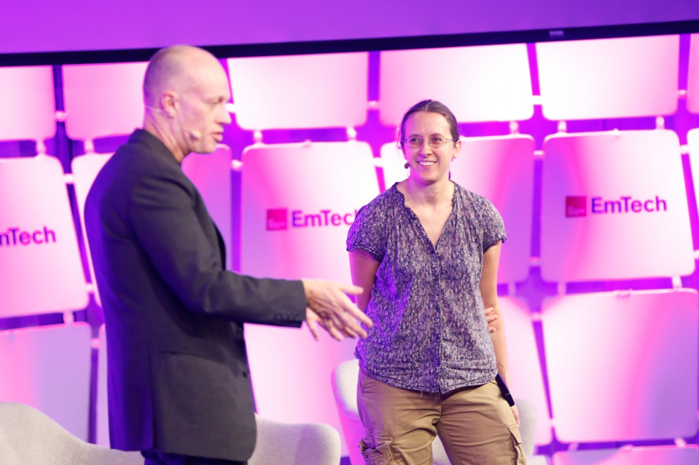
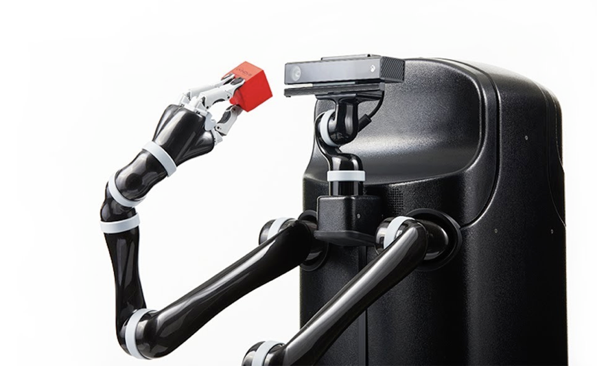
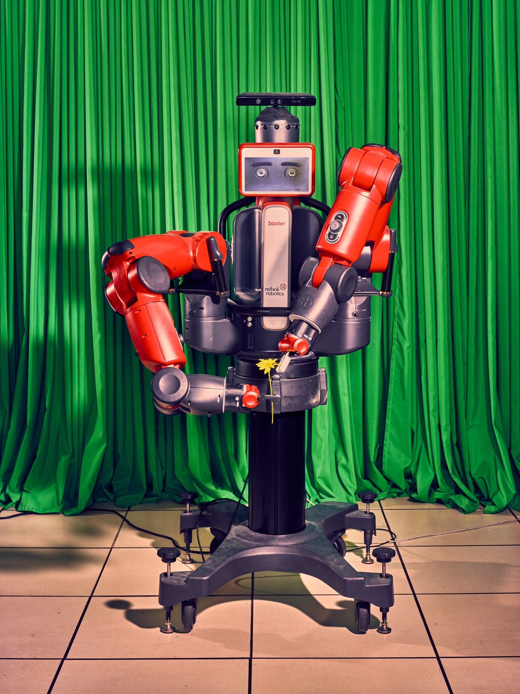
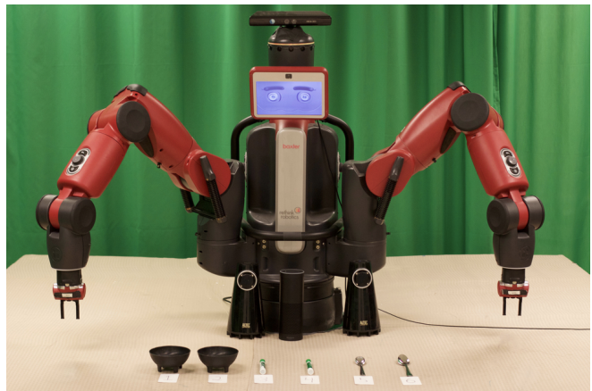

<!-- Main -->

<!-- One -->
<section id="one">
	

		<header class="major">
			<h2>Professors</h2>
		</header>
		
Several of our faculty members and their students are working together to realize our dream of intelligent robots.

	

</section>

<!-- Two -->
<section id="two" class="spotlights">
	<section>
		
		

			

				<header class="major">
					<h3>Stefanie Tellex</h3>
				</header>
				
Stefanie is the director of the Humans To Robots Lab. 

				<ul class="actions">
					<li><a href="http://h2r.cs.brown.edu/" class="button">Learn More</a></li>
				</ul>
			

		

	</section>
	<section>
		
		

			

				<header class="major">
					<h3>George Konidaris </h3>
				</header>
				
George is the director of the Intelligent Robot Lab. 

				<ul class="actions">
					<li><a href="http://irl.cs.brown.edu/" class="button">Learn More</a></li>
				</ul>
			

		

	</section>
	<section>
		
		

			

				<header class="major">
					<h3>Michael Littman </h3>
				</header>
				
Michael leads the Reinforcement Learning & Adaptive Behavior group (RLAB), as well as serving as Co-Director of the <a href="https://hcri.brown.edu/"> Humanity Centered Robotics initiative</a>. 

				<ul class="actions">
					<li><a href="http://cs.brown.edu/~mlittman/" class="button">Learn more</a></li>
				</ul>
			

		

	</section>
</section>

<!-- STUDENTS -->
<section id="one">
	

		<header class="major">
			<h2>Students</h2>
		</header>
		
Meet the students! (coming soon)

	

</section>

<!-- ROBOTS -->
<section id="one">
	

		<header class="major">
			<h2>Robots</h2>
		</header>
		
Meet the robots!

	

</section>

<!-- misstick -->
<section id="two" class="spotlights">
	<section>
		
		

			

				<header class="major">
					<h3> Miss Tick, the Movo</h3>
				</header>
				
 The Movo is our new mobile manipulation platform from Kinova Robotics. Miss Tick is quite impressive: she can <a href="https://www.youtube.com/watch?v=no7pUj1zD4o"> play the ukulele </a> and knows how to write several alphabets! 

			

		

	</section>
</section>

<!-- Winnie -->
<section id="two" class="spotlights">
	<section>
		
		

			

				<header class="major">
					<h3> Winnie, the Baxter</h3>
				</header>
				
 Winnie is shy, but she's an expert at pick and place. 

			

		

	</section>
</section>

<!-- Iorek -->
<section id="two" class="spotlights">
	<section>
		
		

			

				<header class="major">
					<h3> Iorek, the Baxter</h3>
				</header>
				
 Iorek is a proud Baxter, but knows when to <a href="https://www.wired.com/2017/03/meet-lorek-robot-communicates-remarkable-way/"> ask for help</a>! 

			

		

	</section>
</section>

<!-- Kuka -->
<section id="two" class="spotlights">
	<section>
		
		

			

				<header class="major">
					<h3> ____, the KUKA iiwa</h3>
				</header>
				
 We just got a KUKA, who is yet to be named! 

			

		

	</section>
</section>

<!-- Three -->
<section id="three">
	

		<header class="major">
			<h2>Get in touch!</h2>
		</header>
		
 If you have questions or want to learn more, send us a message below! In the meantime, check out our mission statement.
		 

		<ul class="actions">
			<li><a href="about.html" class="button next">Mission</a></li>
		</ul>
	

</section>
