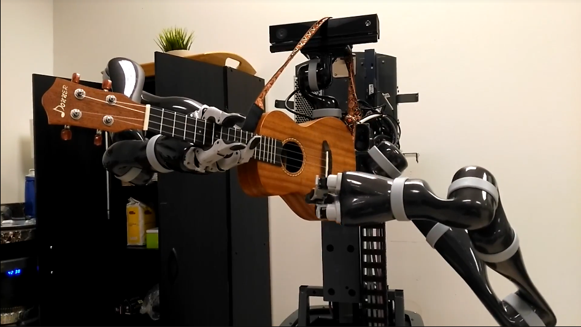

<!-- Main -->

<!-- One -->
<section id="one">
	

		<header class="major">
			<h2>Professors</h2>
		</header>
		
Several of our faculty members and their students are working together to realize our dream of intelligent robots.

	

</section>

<section id="two" class="spotlights">
	<!-- Stefanie -->
	<section>
		
		

			

				<header class="major">
					<h3>Stefanie Tellex</h3>
				</header>
				
 Professor Tellex is the director of the Humans To Robots Lab. 

				<ul class="actions">
					<li><a href="http://h2r.cs.brown.edu/" class="button">Learn More</a></li>
				</ul>
			

		

	</section>
	<!-- GDK -->
	<section>
		
		

			

				<header class="major">
					<h3>George Konidaris </h3>
				</header>
				
 Professor Konidaris is the director of the Intelligent Robot Lab. 

				<ul class="actions">
					<li><a href="http://irl.cs.brown.edu/" class="button">Learn More</a></li>
				</ul>
			

		

	</section>
	<!-- Michael -->
	<section>
		
		

			

				<header class="major">
					<h3>Michael Littman </h3>
				</header>
				
Professor Littman leads the Reinforcement Learning & Adaptive Behavior group (RLAB), as well as serving as Co-Director of the <a href="https://hcri.brown.edu/"> Humanity Centered Robotics initiative</a>. 

				<ul class="actions">
					<li><a href="http://cs.brown.edu/~mlittman/" class="button">Learn more</a></li>
				</ul>
			

		

	</section>
	<!-- Ellie -->
	<section>
		
		

			

				<header class="major">
					<h3>Ellie Pavlick </h3>
				</header>
				
 Professor Pavlick studies computational models of natural language semantics and pragmatics. She leads the Language Understanding And Representation (LUNAR) Lab. 

				<ul class="actions">
					<li><a href="https://cs.brown.edu/people/epavlick/" class="button">Learn more</a></li>
				</ul>
			

		

	</section>
	<!-- Eugene -->
	<section>
		
		

			

				<header class="major">
					<h3>Eugene Charniak</h3>
				</header>
				
 Professor Charniak directs the Brown Laboratory for Linguistic Information Processing (BLLIP). 

				<ul class="actions">
					<li><a href="http://cs.brown.edu/people/echarnia/" class="button">Learn more</a></li>
				</ul>
			

		

	</section>
</section>

<!-- STUDENTS -->
<section id="one">
	

		<header class="major">
			<h2>Students</h2>
		</header>
		
Meet the students! (coming soon)

	

</section>

<!-- ROBOTS -->
<section id="one">
	

		<header class="major">
			<h2>Robots</h2>
		</header>
		
Meet the robots!

	

</section>

<!-- misstick -->
<section id="two" class="spotlights">
	<section>
		
		

			

				<header class="major">
					<h3> Miss Tick, the Movo</h3>
				</header>
				
 The Movo is our mobile manipulation platform from Kinova Robotics. Miss Tick is quite impressive: she can <a href="https://www.youtube.com/watch?v=no7pUj1zD4o"> play the ukulele </a> and <a href="https://www.brown.edu/news/2019-05-15/robowrite"> knows how to write several alphabets! </a>  

			

		

	</section>
</section>

<!-- Winnie -->
<section id="two" class="spotlights">
	<section>
		
		

			

				<header class="major">
					<h3> Winnie, the Baxter</h3>
				</header>
				
 Winnie is shy, but she's an expert at pick and place. 

			

		

	</section>
</section>

<!-- Iorek -->
<section id="two" class="spotlights">
	<section>
		
		

			

				<header class="major">
					<h3> Iorek, the Baxter</h3>
				</header>
				
 Iorek is a proud Baxter, but knows when to <a href="https://www.wired.com/2017/03/meet-lorek-robot-communicates-remarkable-way/"> ask for help</a>! 

			

		

	</section>
</section>

<!-- Kuka -->
<section id="two" class="spotlights">
	<section>
		
		

			

				<header class="major">
					<h3> Detritus, the KUKA iiwa7</h3>
				</header>
				
 Detritus is learning to grasp and manipulate objects. 

			

		

	</section>
</section>

<!-- Amazon Kuka -->
<section id="two" class="spotlights">
	<section>
		
		

			

				<header class="major">
					<h3> Dorfl, the KUKA iiwa7</h3>
				</header>
				
 We recently received another KUKA iiwa7 from Amazon Robotics. Dorfl is learning motor skills with imitation learning. 

			

		

	</section>
</section>

<!-- KURI -->
<section id="two" class="spotlights">
	<section>
		
		

			

				<header class="major">
					<h3> Kuri </h3>
				</header>
				
 Our Kuri robots are learning to recognize human activities and answer queries about them. In the meantime, they sing pancake songs, meow with pleasure, and constantly drive into things. 

			

		

	</section>
</section>

<!-- Three -->
<section id="three">
	

		<header class="major">
			<h2>That's all, folks. </h2>
		</header>
		
 Check out bigAI in the press, and see our publications.
		 

		<ul class="actions">
			<li><a href="press.html" class="button next">Press</a></li>
		</ul>
		<ul class="actions">
			<li><a href="pubs.html" class="button next">Publications</a></li>
		</ul>
	

</section>
