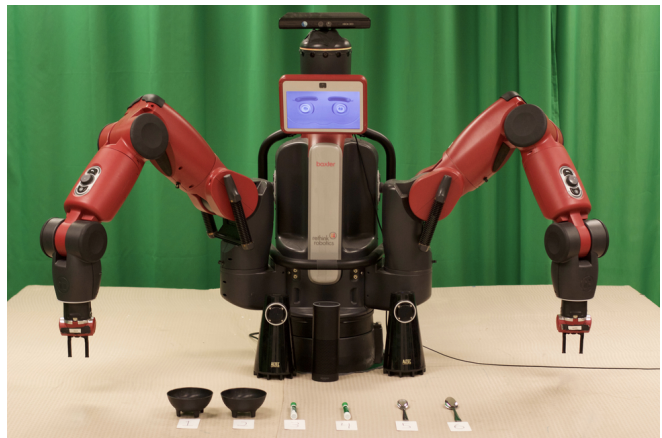
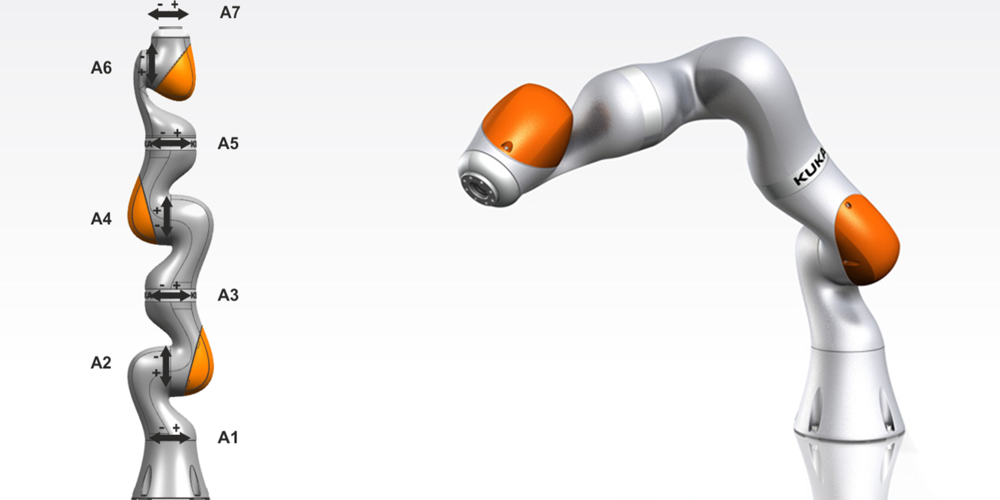

<!-- ROBOTS -->
<section id="one">
	

		<header class="major">
			<h2>Robots</h2>
		</header>
		
Meet the robots!

	

</section>

<!-- misstick -->
<section id="two" class="spotlights">
	<section>
		
		

			

				<header class="major">
					<h3> Miss Tick, the Movo</h3>
				</header>
				
 The Movo is our mobile manipulation platform from Kinova Robotics. Miss Tick is quite impressive: she can <a href="https://www.youtube.com/watch?v=no7pUj1zD4o"> play the ukulele </a> and <a href="https://www.brown.edu/news/2019-05-15/robowrite"> knows how to write several alphabets! </a>  

			

		

	</section>
</section>

<!-- Winnie -->
<section id="two" class="spotlights">
	<section>
		
		

			

				<header class="major">
					<h3> Winnie, the Baxter</h3>
				</header>
				
 Winnie is shy, but she's an expert at pick and place, and has learned to understand natural language task specifications. 

			

		

	</section>
</section>

<!-- Iorek -->
<section id="two" class="spotlights">
	<section>
		
		

			

				<header class="major">
					<h3> Iorek, the Baxter</h3>
				</header>
				
 Iorek is a proud Baxter, but knows when to <a href="https://www.wired.com/2017/03/meet-lorek-robot-communicates-remarkable-way/"> ask for help</a>! 

			

		

	</section>
</section>

<!-- Kuka -->
<section id="two" class="spotlights">
	<section>
		
		

			

				<header class="major">
					<h3> Detritus, the KUKA iiwa7</h3>
				</header>
				
 Detritus is learning to manipulate objects. 

			

		

	</section>
</section>

<!-- Amazon Kuka -->
<section id="two" class="spotlights">
	<section>
		
		

			

				<header class="major">
					<h3> Dorfl, the KUKA iiwa7</h3>
				</header>
				
 Dorfl is learning motor skills with imitation learning. 

			

		

	</section>
</section>

<!-- KURIS -->
<section id="two" class="spotlights">
	<section>
		
		

			

				<header class="major">
					<h3> Kuri </h3>
				</header>
				
 Our Kuri robots are learning to recognize human activities and answer queries about them. In the meantime, they sing pancake songs, meow with pleasure, and constantly drive into things. 

			

		

	</section>
</section>
